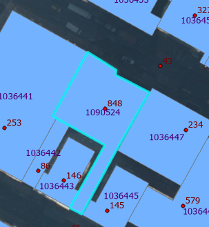

# geodatabase-buildings-height

Update [geodatabase-buildings](https://github.com/mattyschell/geodatabase-buildings) height_roof using [planimetrics](https://github.com/CityOfNewYork/nyc-planimetrics/blob/main/Capture_Rules.md) data.  Let's work in PostGIS to troll ourselves.

We have 2 goals.  

1. Update buildings with NULL or 0 height_roof.  Do this automatically.
2. Update buildings with suspect heights.  When confident do this automatically.  When not confident send to manual review.

We will use two input datasets.  When these datasets agree we have confidence.

1. Planimetrics spot elevations spatially joined to live building shapes
2. Planimetrics buildings height_roof joined on BIN. (use this for updates)


## Manual Preparation

This prep is prep'd.  It is in the data directory.

* Export buildings by borough as 5 shapefiles to the data/ directory as building1.shp, building2.shp etc.  Zip each shapefile up for version control, we wish to slide underneath the github limit of 100MB.  Borough-based processing also is a more reasonable workpace for the later steps. 

* Export elevations with feature_code equal to 3020 as a shapefile named elevation.shp to the data directory.  Zip it also.

* Export elevations with feature_code equal to 300000 as a shapefile named spot_elevation.shp to the data directory.  Zip that bad boy.

Don't bother with removing columns, the ArcGIS Pro GUI requires a galaxy brain when also selecting a subset of records.

* Create a table from planimetrics 2022 "building_footprint" with columns bin, height_roof. This is bin_height.csv in the data directory.


## Database Setup

Create and load a scratch PostGIS database.

```shell
export BLDGPASSWORD=<provide a scratch password>
export PGUSER=postgres
export PGPASSWORD=<your postgres password>
export PGHOST=<your postgres host>
export PGDATABASE=postgres
./setup.sh
```

## Generate Output for Buildings With Null or Zero Height

Tweak the where clause values in sql/bins-missing-height-output.sql to shunt more values into auto-update or into manual review.

```shell
export PGPASSWORD=<scratch password from setup>
export PGHOST=<your postgres host>
export PGUSER=bldg
export PGDATABASE=buildingscratch
./generate-missing-height-output.sh
```

See
* output\bins_missing_height_update.csv 
* output\bins_missing_height_review.csv 

## Evaluate Buildings With Suspect Heights

TBD


## Remove data\temp and Teardown Database

```shell
export BLDGPASSWORD=<scratch password from setup>
export PGUSER=postgres
export PGPASSWORD=<your postgres password>
export PGHOST=<your postgres host>
export PGDATABASE=postgres
./teardown.sh
```

## Examples

| BIN | Height Roof OTI | Planimetrics | Planimetrics Data | Visual Check |
| --- | --- | --- | --- | --- |
| 5166155 | null | 201 |  |  |
| 5166990 | 166 | 36 |  |  |
| 1090524 | 264 | 804 |  |  |

